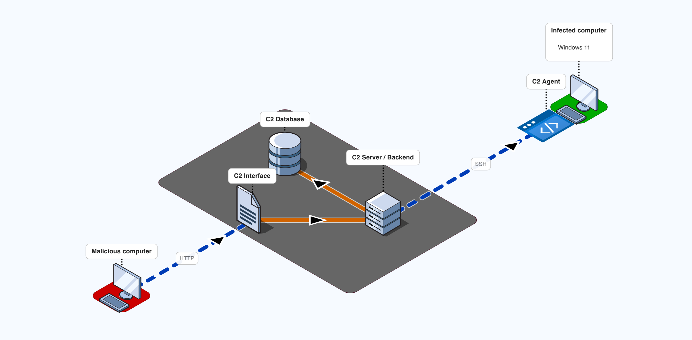
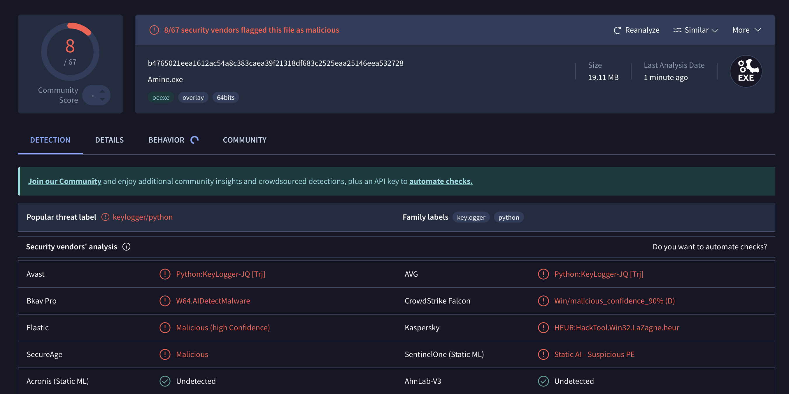

# C2

## Architecture Globale

## Virus Total check

## Fonctionnalités

L'agent implémente une architecture modulaire communiquant via un canal SSH chiffré (Paramiko) avec une clé privée embarquée.

- **Keylogger** : Enregistre les frappes au clavier en utilisant une méthode de polling C# injectée via PowerShell. Compatible avec les services Windows (Session 0) et peut fonctionner même sans fenêtre visible. Les logs sont sauvegardés dans un fichier accessible et peuvent être récupérés via la commande DUMP.
- **Screenshot** : Prend des captures d'écran même si l'agent tourne en tant que service Windows (Session 0) en injectant un processus de capture dans la session utilisateur active. Utilise MSS (Multi-Screen Shot) ou PowerShell selon le contexte d'exécution. Les images sont compressées et encodées en base64 pour l'exfiltration.
- **Privesc** : Vérifie les privilèges actuels et les vecteurs d'escalade potentiels sur Windows. Affiche si l'utilisateur a des privilèges administrateur et liste tous les privilèges disponibles (ex: SeBackupPrivilege) via la commande `whoami /priv`.
- **Shell** : Établit une connexion reverse shell vers le serveur C2 pour permettre une interaction interactive avec le système cible. Permet d'exécuter des commandes en temps réel avec retour de sortie continu.
- **Cmd** : Exécute une commande système et retourne le résultat. Permet d'exécuter des commandes arbitraires sur le système cible. Le résultat inclut la sortie standard et les erreurs.
- **Creds LSASS (Hash)** : Récupère les SAM et SYSTEM hives (fichiers de registre Windows) contenant les hashes de mots de passe des utilisateurs locaux. Utilise des méthodes de copie natives pour contourner les verrous de fichiers système (nécessite des privilèges d'administrateur/SeBackupPrivilege).
- **Creds Navigator** : Récupère les identifiants, URLs et mots de passe sauvegardés dans Microsoft Edge. Extraction avancée des clés AES locales via DPAPI. Gère les formats de chiffrement v10 (AES-GCM) et implémente un déchiffrement local sur l'agent pour le format complexe v20 (App-Bound Encryption) en utilisant une approche "double DPAPI", le support de ChaCha20-Poly1305, et des appels aux objets COM Windows (`IElevator`).
- **Destroy** : Détruit complètement l'agent et le service Windows associé (AmineIsBack). Arrête et désinstalle le service, supprime la persistance, ferme les connexions SSH, et nettoie le binaire de l'agent ainsi que ses logs pour effacer toute trace de présence.
- **Exit** : Quitte proprement l'agent en fermant toutes les connexions et en libérant les ressources de manière contrôlée.
- **Anti-Debug & Furtivité** : Intègre des vérifications pour détecter l'exécution sous un débogueur, interrompant le processus immédiatement si nécessaire. S'exécute silencieusement en tant que Service Windows autonome avec reconnexion automatique.

